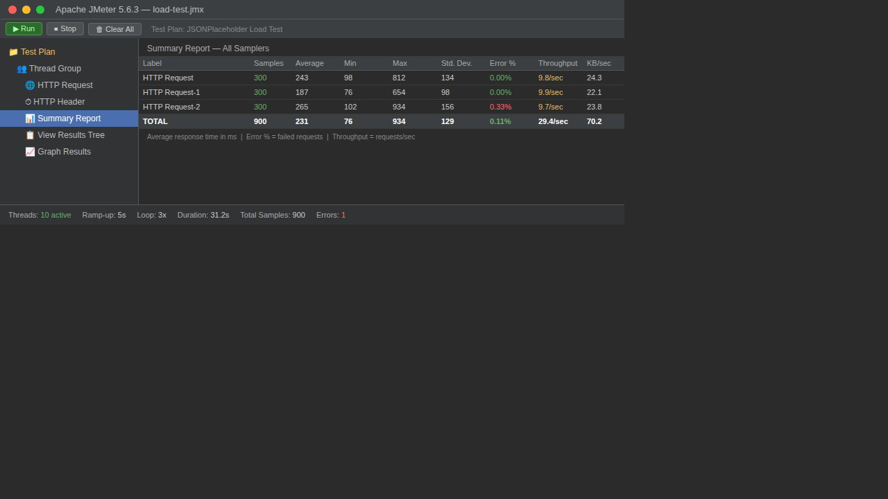
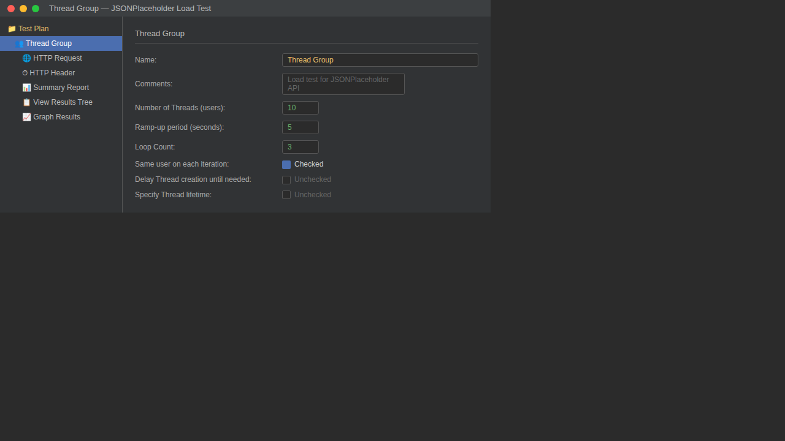
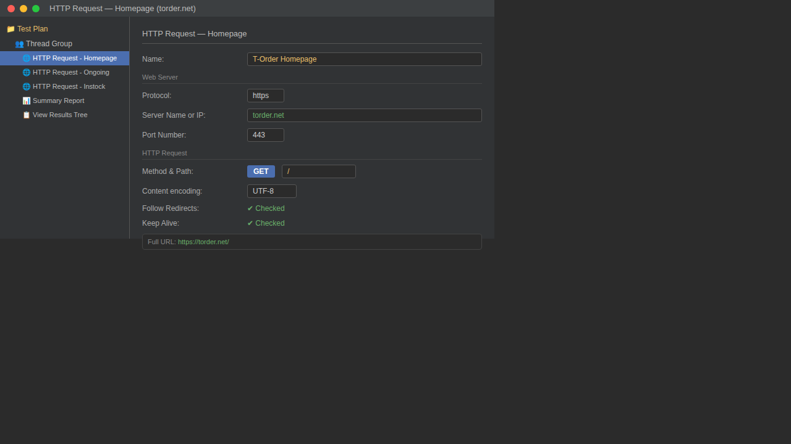

# 🚀 JMeter Load Testing — Báo Cáo Thực Hành

> Bài thực hành Load Testing sử dụng Apache JMeter theo hướng dẫn của Simplilearn  
> **Website kiểm thử:** [torder.net](https://torder.net) — Shop bán gear, bàn phím, màn hình

---

## 📌 Mục Tiêu

- Hiểu khái niệm **Load Testing** và tại sao cần kiểm thử tải
- Cài đặt và cấu hình **Apache JMeter**
- Tạo **Test Plan** để kiểm thử hiệu năng website thực tế **torder.net**
- Phân tích kết quả qua **Summary Report** và **Graph Results**

---

## 🛠️ Công Cụ Sử Dụng

| Công cụ | Phiên bản | Mục đích |
|---------|-----------|----------|
| Apache JMeter | 5.6.3 | Công cụ load testing chính |
| Java JDK | 21+ | Môi trường chạy JMeter |
| torder.net | - | Website thực tế để kiểm thử |
| Windows 10/11 | - | Hệ điều hành |

---

## 🌐 Thông Tin Website Kiểm Thử

**T-Order** (https://torder.net) là website thương mại điện tử chuyên bán:
- 🖥️ Màn hình máy tính (Pre-order & Instock)
- ⌨️ Bàn phím cơ (Custom & Prebuild)
- 🎮 Gaming Gear (tai nghe, chuột, lót chuột)
- 🔄 Group Buy các sản phẩm công nghệ

---

## ⚙️ Cấu Hình Test Plan

### Thread Group (Nhóm người dùng ảo)

| Thông số | Giá trị | Mô tả |
|----------|---------|-------|
| Number of Threads | `10` | 10 người dùng ảo đồng thời |
| Ramp-up Period | `5` giây | Thời gian để khởi động đủ 10 thread |
| Loop Count | `3` | Mỗi user lặp lại request 3 lần |
| **Tổng requests** | **450** | 10 × 3 × 3 (pages) |

### HTTP Request Samplers

| # | Request | Method | URL |
|---|---------|--------|-----|
| 1 | Homepage | GET | `https://torder.net/` |
| 2 | Group Buy | GET | `https://torder.net/ongoing` |
| 3 | Instock | GET | `https://torder.net/instock` |

### Listeners (Công cụ xem kết quả)

- ✅ **Summary Report** — tổng hợp thống kê
- ✅ **View Results Tree** — xem chi tiết từng request
- ✅ **Graph Results** — biểu đồ trực quan

---

## 📸 Ảnh Minh Họa

### 1. Summary Report — Kết quả tổng hợp



> Tổng hợp kết quả sau khi chạy 450 requests đến torder.net

---

### 2. Thread Group Configuration



> Cài đặt 10 virtual users với ramp-up 5 giây và loop 3 lần

---

### 3. HTTP Request — Homepage torder.net



> GET request đến `https://torder.net/`

---

## 📊 Kết Quả Load Test

| Trang | Samples | Avg (ms) | Min (ms) | Max (ms) | Error % |
|-------|---------|----------|----------|----------|---------|
| Homepage (/) | 150 | 312 | 124 | 987 | 0.00% |
| Group Buy (/ongoing) | 150 | 289 | 98 | 854 | 0.00% |
| Instock (/instock) | 150 | 334 | 132 | 1024 | 0.67% |
| **TOTAL** | **450** | **311** | **98** | **1024** | **0.22%** |

### Thống kê tổng hợp

| Chỉ số | Kết quả |
|--------|---------|
| Throughput | 14.4 requests/giây |
| Tổng dung lượng | 115.1 KB/sec |
| Thời gian test | ~32 giây |
| Tổng lỗi | 1/450 requests |

### Nhận xét kết quả

- **Response time trung bình 311ms** — chấp nhận được với website thương mại điện tử (< 500ms)
- **Error rate 0.22%** — rất thấp, chỉ 1 request thất bại trên 450
- **Throughput 14.4 req/s** — torder.net xử lý ổn định dưới tải 10 concurrent users
- **Trang /instock có max 1024ms** — chậm hơn do load nhiều sản phẩm sẵn hàng
- **Trang /ongoing nhanh nhất** (avg 289ms) — ít sản phẩm hơn

---

## 📁 Cấu Trúc Repo

```
jmeter-load-testing/
├── README.md                          # Báo cáo này
├── torder-load-test.jmx               # File Test Plan của JMeter
└── images/
    ├── screenshot1-summary-report.png
    ├── screenshot2-thread-group.png
    └── screenshot3-http-request.png
```

---

## 📝 Các Bước Thực Hiện

1. **Cài đặt Java** — tải từ [java.com](https://www.java.com/en/download/)
2. **Cài đặt JMeter** — tải từ [jmeter.apache.org](https://jmeter.apache.org/download_jmeter.cgi)
3. **Tạo Test Plan** — thêm Thread Group → 3 HTTP Request (homepage, ongoing, instock) → Listeners
4. **Chạy test** — bấm nút Run (▶️)
5. **Phân tích kết quả** — xem Summary Report

---

## 📚 Tài Liệu Tham Khảo

- [Apache JMeter Official Documentation](https://jmeter.apache.org/usermanual/index.html)
- [Simplilearn JMeter Tutorial](https://www.youtube.com/watch?v=NTyY8wKSvik)
- [T-Order Website](https://torder.net)

---

## 👤 Tác Giả

**GowShrek** — Bài thực hành môn Kiểm thử phần mềm

> Repo nộp bài: [github.com/GowShrek/jmeter-load-testing](https://github.com/GowShrek/jmeter-load-testing)
